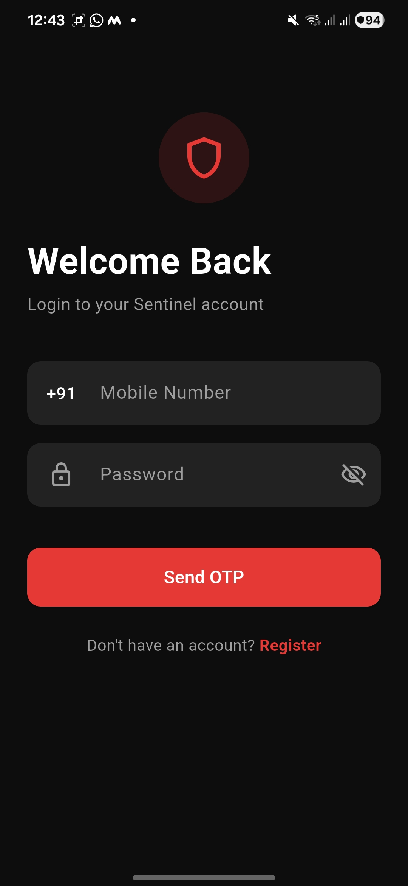
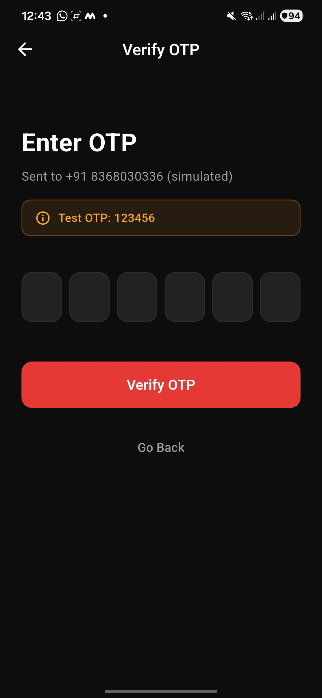
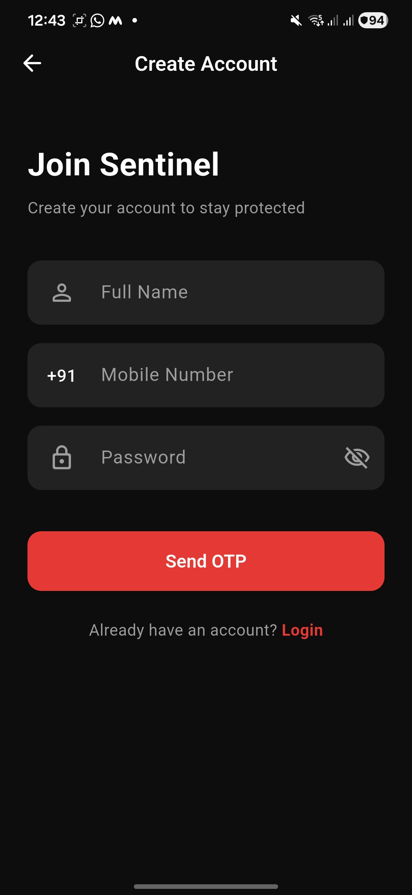
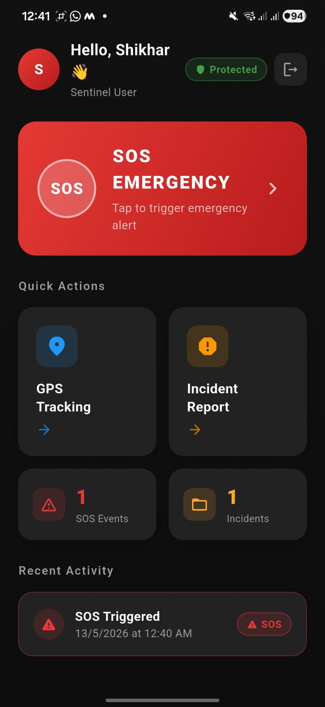
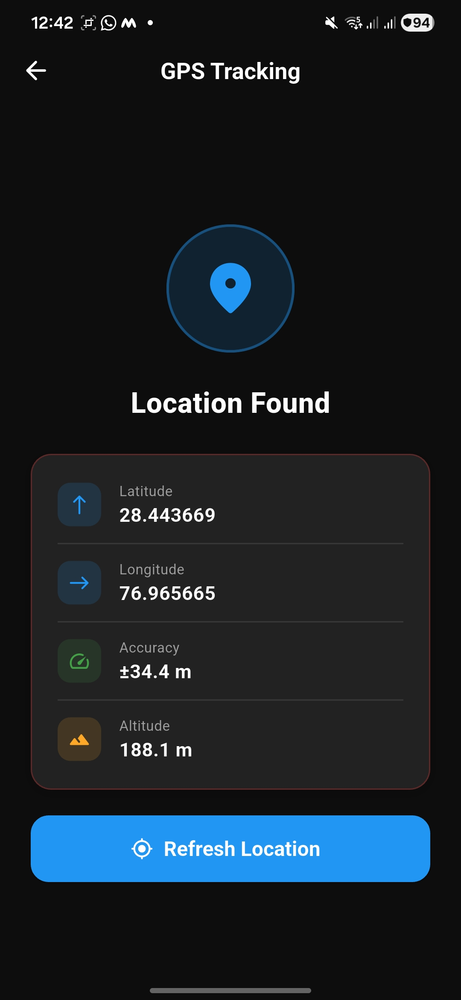
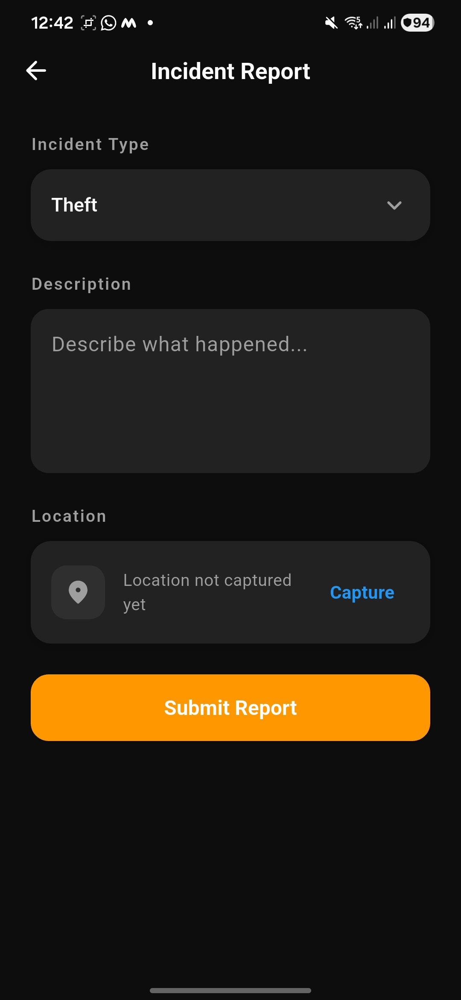
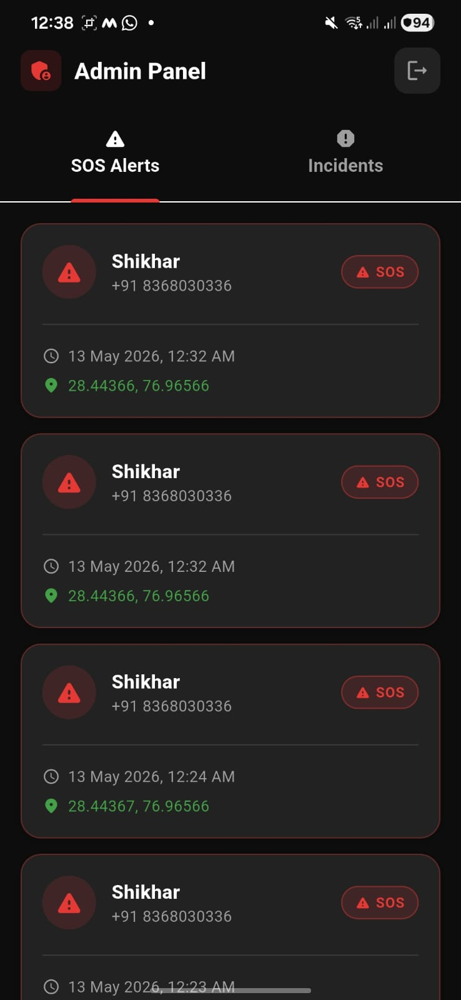
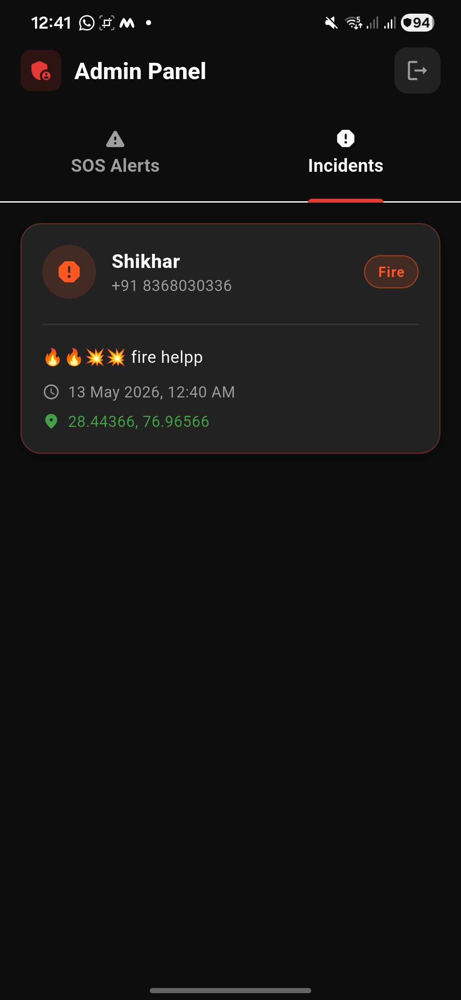

# 🛡️ Sentinel — Personal Safety MVP App

A Flutter-based personal safety application with real-time SOS alerts, GPS tracking, incident reporting, and an admin monitoring panel.

---

# 📱 Overview

Sentinel is a mobile safety MVP built using Flutter and Firebase.

The app enables users to:

- Register and log in securely
- Trigger SOS emergencies
- Track real-time GPS location
- Report incidents with location capture
- View recent activity

An Admin Panel allows monitoring of all SOS alerts and incidents in real time.

---

# ✨ Features

## 👤 User Features

| Feature | Description |
|---|---|
| Registration | Name + Mobile + Password (SHA-256 hashed) |
| Login | Mobile + Password + Static OTP verification |
| OTP Simulation | Static OTP (`123456`) for MVP testing |
| SOS Alert | One-tap emergency trigger with confirmation popup |
| GPS Tracking | Real-time latitude, longitude, altitude & accuracy |
| Incident Reporting | Type, description, optional image & auto location |
| Recent Activity | Live SOS history using Firestore streams |

---

## 🔐 Admin Features

| Feature | Description |
|---|---|
| Admin Login | Hardcoded admin credentials |
| SOS Monitoring | View all SOS alerts in real time |
| Incident Monitoring | View all reported incidents |
| Live Firestore Streams | Auto updates without refresh |

---

# 🚀 Tech Stack

| Layer | Technology |
|---|---|
| Framework | Flutter 3.x (Dart) |
| State Management | GetX |
| Backend | Firebase |
| Authentication | Firebase Anonymous Auth |
| Database | Cloud Firestore |
| Location Services | Geolocator |
| OTP Input | Pinput |
| Hashing | Crypto (SHA-256) |
| Permissions | Permission Handler |

---

# 📂 Project Structure

```bash
lib/
├── main.dart
├── firebase_options.dart
├── core/
│   ├── constants/
│   │   └── app_constants.dart
│   └── theme/
│       ├── app_colors.dart
│       └── app_theme.dart
├── shared/
│   └── widgets/
│       ├── app_button.dart
│       ├── app_text_field.dart
│       ├── app_card.dart
│       ├── app_avatar.dart
│       ├── app_badge.dart
│       ├── app_gradient_container.dart
│       └── loading_overlay.dart
└── features/
    ├── auth/
    │   ├── controllers/
    │   │   └── auth_controller.dart
    │   └── screens/
    │       ├── mobile_input_screen.dart
    │       ├── register_screen.dart
    │       └── otp_screen.dart
    ├── home/
    │   └── screens/
    │       └── home_screen.dart
    ├── sos/
    │   ├── controllers/
    │   │   └── sos_controller.dart
    │   └── screens/
    │       └── sos_screen.dart
    ├── gps/
    │   └── screens/
    │       └── gps_screen.dart
    ├── incident/
    │   ├── controllers/
    │   │   └── incident_controller.dart
    │   └── screens/
    │       └── incident_screen.dart
    └── admin/
        └── screens/
            └── admin_screen.dart
```

---

# ⚙️ Setup & Installation

## Prerequisites

- Flutter SDK >= 3.7.0
- Android Studio / VS Code
- Firebase Project
- Java 17+

---

## 1️⃣ Clone Repository

```bash
git clone https://github.com/yourusername/sentinel.git
cd sentinel
```

---

## 2️⃣ Install Dependencies

```bash
flutter pub get
```

---

## 3️⃣ Firebase Setup

Install FlutterFire CLI:

```bash
dart pub global activate flutterfire_cli
```

Configure Firebase:

```bash
flutterfire configure
```

---

## Firebase Console Setup

### Authentication
Enable:
- Anonymous Authentication

### Firestore Database
- Create database in test mode

---

## 4️⃣ Run Application

```bash
flutter run
```

---

# 🗄️ Firestore Indexes Required

Create the following indexes in Firebase Console:

| Collection | Field 1 | Field 2 |
|---|---|---|
| sos_events | uid Ascending | timestamp Descending |
| incidents | uid Ascending | timestamp Descending |

### Single Field Indexes

| Collection | Field | Order |
|---|---|---|
| sos_events | timestamp | Descending |
| incidents | timestamp | Descending |

---

# 🔑 Login Credentials

## 👤 Regular User

| Field | Value |
|---|---|
| Mobile | Any 10-digit number |
| Password | User created |
| OTP | `123456` |

---

## 🔐 Admin

| Field | Value |
|---|---|
| Mobile | `0000000000` |
| Password | `admin123` |

---

# 🗺️ App Flow

```text
Launch App
   │
   ├── Login Screen
   │      ├── Admin Login → Admin Panel
   │      └── User Login → OTP Verification → Home
   │
   └── Register Screen
           └── OTP Verification → Home
                    │
                    ├── SOS Module
                    ├── GPS Tracking
                    └── Incident Reporting
```

---

# 🗃️ Firestore Data Structure

## users collection

```json
{
  "uid": "firebase_uid",
  "name": "John Doe",
  "mobile": "9876543210",
  "passwordHash": "sha256_hash",
  "createdAt": "timestamp"
}
```

---

## sos_events collection

```json
{
  "uid": "firebase_uid",
  "timestamp": "datetime",
  "latitude": 28.6139,
  "longitude": 77.2090,
  "locationAvailable": true
}
```

---

## incidents collection

```json
{
  "uid": "firebase_uid",
  "type": "Theft",
  "description": "Incident details",
  "imageUrl": null,
  "latitude": 28.6139,
  "longitude": 77.2090,
  "locationCaptured": true,
  "timestamp": "datetime"
}
```

---

# 📦 Dependencies

```yaml
firebase_core: ^3.13.0
firebase_auth: ^5.5.0
cloud_firestore: ^5.6.0
get: ^4.7.2
geolocator: ^14.0.0
pinput: ^5.0.0
intl: ^0.20.2
crypto: ^3.0.3
permission_handler: ^11.4.0
image_picker: ^1.1.2
```

---

# 🔒 Security Notes

- Passwords are SHA-256 hashed before storage
- Plain text passwords are never saved
- Firebase Anonymous Auth handles sessions
- Firestore rules should be secured before production
- Admin credentials should move to environment variables in production

---

# 🚧 Known Limitations

- Static OTP (`123456`) used for MVP
- Firebase Storage not integrated
- No push notifications
- Anonymous Auth creates new UID on logout/login
- Admin credentials are hardcoded

---

# 🛣️ Future Improvements

- Firebase Phone Authentication
- Emergency contact SMS alerts
- Push notifications for admins
- Google Maps integration
- Offline support
- Analytics dashboard
- Panic button shortcut
- Image upload with Firebase Storage

---

# 🧪 Testing Notes

## Tested On

- Android Emulator
- Physical Android Device

## Edge Cases Handled

- Empty field validation
- Invalid OTP handling
- Permission denied states
- GPS unavailable state
- Firestore save failures
- Async loading states

---

# 📸 Screenshots

## 🔐 Authentication

<table>
<tr>
<td align="center">

<br/>
<b>Login Screen</b>
</td>

<td align="center">

<br/>
<b>OTP Verification</b>
</td>

<td align="center">

<br/>
<b>Register Screen</b>
</td>
</tr>
</table>

---

## 🏠 User Dashboard

<table>
<tr>
<td align="center">

<br/>
<b>Home Screen</b>
</td>

<td align="center">

<br/>
<b>GPS Tracking</b>
</td>
</tr>
</table>

---

## 🚨 Emergency & Incident

<table>
<tr>
<td align="center">

<br/>
<b>SOS Alert</b>
</td>

<td align="center">

<br/>
<b>Incident Reporting</b>
</td>
</tr>
</table>

---

## 🛡️ Admin Panel

<table>
<tr>
<td align="center">

<br/>
<b>Admin Dashboard</b>
</td>

<td align="center">

<br/>
<b>Admin Monitoring</b>
</td>
</tr>
</table>

# 👨‍💻 Built With

- Flutter
- Firebase
- GetX
- Geolocator

---

# 📄 Assignment Submission Notes

This project was developed as part of a technical evaluation assignment for Sentinel.

Focus areas during development:

- Clean architecture
- Reusable components
- Real-time Firebase integration
- Product-oriented UI/UX
- Edge case handling
- Practical MVP implementation

---

# 📄 License

This project is built for educational and evaluation purposes only.
